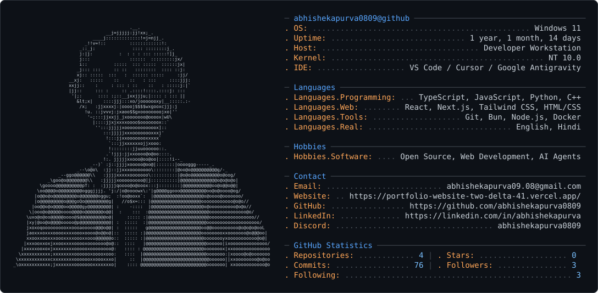

# gh-ascii — Customized Terminal/Neofetch GitHub Profile Card

> A customized fork of [`gh-ascii`](https://github.com/crafter-station/gh-ascii) designed for creating a professional, terminal/neofetch-style GitHub profile card with ASCII avatar art, dynamic GitHub API statistics, customizable developer environment details, and automated GitHub Actions updates.



---

## ✨ Features

* 🖼️ **ASCII Avatar Art**: GitHub profile avatar automatically converted to ASCII art with detail level control.
* 📊 **Dynamic GitHub API Statistics**: Repositories, Commits, Stars, Followers, Following, and Top Languages fetched live from GitHub.
* 🖥️ **Customizable Environment Section**: Configurable OS, Host, Kernel, IDE, and dynamic/custom account Uptime.
* 💻 **Categorized Languages Section**: Programming languages, Web technologies, Developer tools, and Spoken languages.
* 🎮 **Hobbies Section**: Categorized Software and Hardware interests.
* 📫 **Contact & Social Links**: Email, Website, GitHub, LinkedIn, and Discord.
* ⚙️ **Single Configuration File**: Centralized `profile.config.ts` for all personal profile information.
* ⚡ **CLI Generator**: Standalone offline SVG generator (`bun run generate`).
* 🌙 **Dark & Light Mode**: Generates both `dark_mode.svg` and `light_mode.svg`.
* 🤖 **Automated Updates**: Scheduled GitHub Actions workflow updating SVGs every 6 hours and on manual trigger (`workflow_dispatch`).

---

## 🖥️ Profile Card Structure

The SVG card is generated in a clean terminal monospace format:

```text
┌─────────────────────────────────────────────────────────────────────────────┐
│                                                                             │
│   ASCII ART             ── username@github ──────────────────────────────   │
│                         . OS: ...................... Windows 11 / Linux     │
│                         . Uptime: .................. 3 years, 2 months      │
│                         . Host: .................... Developer Workstation  │
│                         . Kernel: .................. NT 10.0 / 6.x          │
│                         . IDE: ..................... VS Code / Cursor       │
│                                                                             │
│                         ── Languages ────────────────────────────────────   │
│                         . Languages.Programming: ... TypeScript, Python...  │
│                         . Languages.Web: ........... React, Next.js, HTML   │
│                         . Languages.Tools: ......... Git, Bun, Docker       │
│                         . Languages.Real: .......... English, Hindi         │
│                                                                             │
│                         ── Hobbies ──────────────────────────────────────   │
│                         . Hobbies.Software: ........ Open Source, Web Dev   │
│                         . Hobbies.Hardware: ........ PC Building, Gadgets   │
│                                                                             │
│                         ── Contact ──────────────────────────────────────   │
│                         . Email: ................... email@example.com      │
│                         . Website: ................. https://yourwebsite.com│
│                         . GitHub: .................. github.com/username    │
│                         . LinkedIn: ................ linkedin.com/in/user   │
│                         . Discord: ................. username               │
│                                                                             │
│                         ── GitHub Statistics ────────────────────────────   │
│                         . Repositories: ........ 45 | . Stars: ........ 120 │
│                         . Commits: ............ 850 | . Followers: .... 230 │
│                         . Following: .───────── 150 | . Top Lang: ── TypeScript│
│                                                                             │
└─────────────────────────────────────────────────────────────────────────────┘
```

---

## ⚙️ Configuration (`profile.config.ts`)

All personal details are managed in one central file: [`profile.config.ts`](./profile.config.ts).

```typescript
export const profileConfig: ProfileConfig = {
  username: "abhishekapurva0809",
  env: {
    os: "Windows 11 / Linux",
    uptime: "auto", // "auto" calculates account uptime dynamically from GitHub creation date
    host: "Developer Workstation",
    kernel: "NT 10.0 / 6.x",
    ide: "VS Code / Cursor",
  },
  languages: {
    programming: ["TypeScript", "JavaScript", "Python", "C++"],
    web: ["React", "Next.js", "Tailwind CSS", "HTML/CSS"],
    tools: ["Git", "Bun", "Node.js", "Docker"],
    real: ["English", "Hindi"],
  },
  hobbies: {
    software: ["Open Source", "Web Development", "AI Agents"],
    hardware: ["PC Building", "Gadgets"],
  },
  contact: {
    email: "abhishekapurva0809@gmail.com",
    website: "https://github.com/abhishekapurva0809",
    github: "github.com/abhishekapurva0809",
    linkedin: "linkedin.com/in/abhishekapurva0809",
    discord: "abhishekapurva",
  },
};
```

---

## 🚀 Local Usage

### 1. Install dependencies
```bash
bun install
```

### 2. Generate Profile Cards locally
```bash
bun run generate
```
This produces `dark_mode.svg` and `light_mode.svg` in the project root directory.

### 3. Run Development Web Server
```bash
bun run dev
```
Open `http://localhost:3000` or visit `http://localhost:3000/abhishekapurva0809?theme=dark`.

---

## 🤖 GitHub Actions Automatic Updates

The workflow [`.github/workflows/update-card.yml`](./.github/workflows/update-card.yml) runs every **6 hours** and on manual trigger (`workflow_dispatch`).

### Dual-Repository Setup:
1. **Generator Repo**: `abhishekapurva0809/gh-ascii` (runs workflow, generates SVGs).
2. **Profile Repo**: `abhishekapurva0809/abhishekapurva0809` (hosts profile `README.md`).

### Cross-Repo Authentication (Optional but Recommended):
1. Create a GitHub Personal Access Token (PAT) with `repo` (`Contents: Read & write`) access for `abhishekapurva0809/abhishekapurva0809`.
2. Go to **gh-ascii** -> **Settings** -> **Secrets and variables** -> **Actions**.
3. Add a Repository Secret named **`PROFILE_REPO_PAT`**.

When `PROFILE_REPO_PAT` is configured, the workflow automatically commits updated `dark_mode.svg` and `light_mode.svg` files directly to your profile README repository **only when statistics or avatar content change**.

---

## 🧩 Embedding in GitHub Profile README

Add this `<picture>` block to the top of your `README.md` inside your profile repository (`abhishekapurva0809/abhishekapurva0809`):

```html
<picture>
  <source media="(prefers-color-scheme: dark)" srcset="./dark_mode.svg" />
  <source media="(prefers-color-scheme: light)" srcset="./light_mode.svg" />
  
</picture>
```

---

## 🛠️ Tech Stack

* **TypeScript & Bun**
* **GitHub REST API** (`/users/{login}`, `/users/{login}/repos`, `/search/commits`)
* **Jimp & ONNX Background Removal** (`@imgly/background-removal-node`)
* **SVG & Monospace Typography**
* **GitHub Actions** (`oven-sh/setup-bun`, `actions/checkout`)

---

## 🙏 Credits

Based on original [`crafter-station/gh-ascii`](https://github.com/crafter-station/gh-ascii). Extended with neofetch profile sections, single configuration file, standalone CLI generation, and automated dual-repo GitHub Actions integration.
